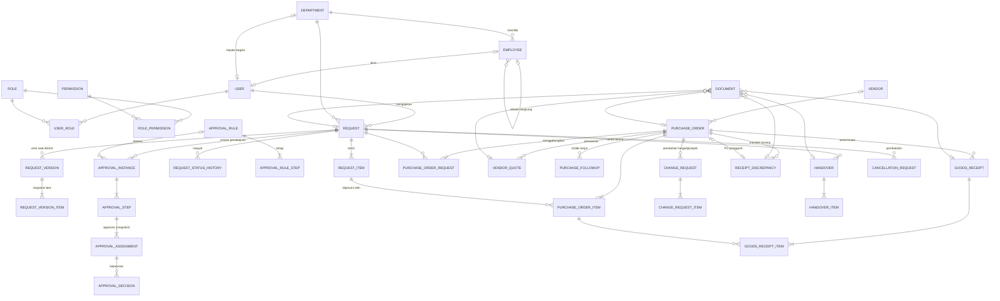

# Struktur Data (ERD)

Sumber kebenaran: [`prisma/schema.prisma`](../../prisma/schema.prisma) dan migrasi di
[`prisma/migrations`](../../prisma/migrations). Diagram ini merangkum relasi utama.

## Alur inti

## Daftar tabel per kelompok

| Kelompok | Tabel |
|---|---|
| Organisasi & akses | `departments`, `employees`, `users`, `roles`, `permissions`, `user_roles`, `role_permissions`, `user_department_scopes`, `sessions`, `password_reset_tokens`, `login_attempts` |
| Katalog & vendor | `item_categories`, `catalog_items`, `vendors` |
| Pengajuan | `requests`, `request_items`, `request_versions`, `request_version_items`, `request_status_history`, `comments` |
| Persetujuan | `approval_rules`, `approval_rule_steps`, `approval_instances`, `approval_steps`, `approval_assignments`, `approval_decisions` |
| Purchasing | `purchase_orders`, `purchase_order_requests`, `purchase_order_items`, `vendor_quotes`, `purchase_order_status_history`, `purchase_followups`, `change_requests`, `change_request_items`, `department_budgets` |
| Penerimaan & serah terima | `goods_receipts`, `goods_receipt_items`, `receipt_discrepancies`, `handovers`, `handover_items`, `cancellation_requests` |
| Dokumen | `documents` (tepat satu induk — dijaga CHECK constraint), `document_requirements` |
| Notifikasi | `notifications` (dengan `dedupe_key`), `email_outbox` |
| Sistem | `audit_logs`, `system_settings`, `number_sequences`, `idempotency_keys`, `holidays` |
| Bantuan | `support_tickets`, `support_ticket_comments`, `faq_articles` |

## Aturan integritas penting

- **Buku besar kuantitas per item**: dibutuhkan = `quantity − cancelled_quantity`; dialokasikan =
  Σ(`quantity_ordered − closed_quantity`) PO aktif; diterima dan diserahkan dihitung dari penerimaan &
  serah terima. Constraint CHECK di database mencegah nilai negatif serta pembatalan/penutupan yang
  melebihi jumlah; alokasi berlebih ke PO dicegah oleh service sebelum disimpan.
- **Satu baris PO = satu item pengajuan**; penggabungan beberapa pengajuan terjadi di tingkat PO
  (`purchase_order_requests`), sehingga jejak dari kebutuhan ke pembelian tidak pernah hilang.
- **Approver di-snapshot** ke `approval_assignments` saat proses dimulai — perubahan matriks tidak
  mengubah proses yang sedang berjalan.
- **Versi pengajuan** (`request_versions`) disimpan setiap kali dikirim, sebagai dasar perbandingan
  revisi dan *carry-over* persetujuan.
- **Penomoran** `PB/PO/GR/ST/TK-YYYY-00001` dari `number_sequences` (aman dari balapan).
- **Optimistic locking** (`lock_version`) pada pengajuan & PO; **idempotency key** untuk aksi kirim.
- **RLS** aktif pada semua tabel tanpa policy; hak `anon`/`authenticated` dicabut (khusus Supabase).
- Waktu disimpan sebagai `timestamptz`; tanggal kebutuhan/ETA sebagai `date`; uang `numeric(18,2)`,
  kuantitas `numeric(18,3)`.
