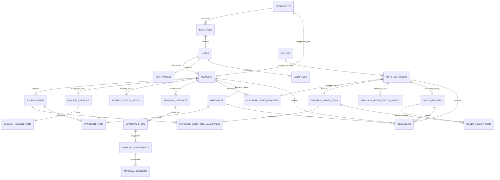
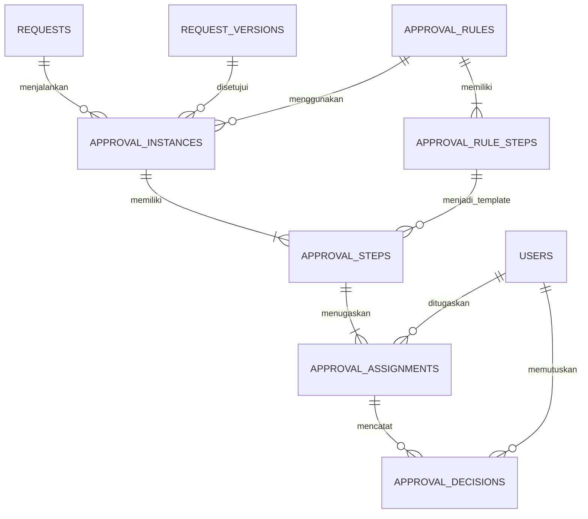

# ERD Final — Sistem Pengajuan Barang dan Pelacakan Purchasing

**Versi:** 1.0
**Status:** Baseline desain database untuk implementasi
**Database:** PostgreSQL
**ORM:** Prisma ORM
**Backend:** NestJS + TypeScript
**Frontend:** Next.js + TypeScript
**Arsitektur:** Modular Monolith
**Bahasa sistem:** Indonesia

---

## 1. Tujuan Desain Database

Database ini dirancang untuk mendukung siklus hidup pengajuan barang, mulai dari pengajuan oleh pegawai hingga proses pembelian, penerimaan dari vendor, serah terima kepada pemohon, dan penyelesaian transaksi.

Desain harus memenuhi prinsip berikut:

1. **Data konsisten:** hubungan antartabel menggunakan primary key dan foreign key.
2. **Riwayat terjaga:** perubahan data, revisi pengajuan, dan keputusan persetujuan tidak menghapus sejarah sebelumnya.
3. **Persetujuan fleksibel:** aturan persetujuan dapat dikonfigurasi berdasarkan nominal, jenis pengajuan, dan unit kerja.
4. **Pembelian fleksibel:** satu pesanan pembelian dapat menangani beberapa pengajuan jika memang digabungkan.
5. **Penerimaan terukur:** barang dapat diterima sebagian, dengan setiap penerimaan tercatat.
6. **Dokumen aman:** file disimpan di penyimpanan file privat, sedangkan database menyimpan metadata dan lokasi file.
7. **Siap berkembang:** penambahan modul keuangan, inventaris, aset, atau integrasi HRIS tidak mengharuskan seluruh database dibangun ulang.

### Konvensi Penamaan

- Nama tabel dan kolom menggunakan `snake_case`.
- Primary key menggunakan UUID.
- Waktu disimpan sebagai `TIMESTAMPTZ`.
- Nominal uang menggunakan `NUMERIC`, bukan `FLOAT`.
- Data master yang dinonaktifkan menggunakan status aktif/nonaktif.
- Transaksi yang sudah terjadi tidak dihapus secara fisik oleh pengguna biasa.
- Seluruh waktu aplikasi disimpan dalam UTC dan ditampilkan dalam zona waktu yang sesuai, misalnya WITA.

---

## 2. Gambaran Besar ERD

Database dibagi menjadi sembilan kelompok:

1. Pengguna, pegawai, unit kerja, dan hak akses.
2. Katalog barang dan jasa.
3. Pengajuan dan revisi.
4. Aturan serta proses persetujuan.
5. Purchasing, vendor, penawaran, dan pesanan pembelian.
6. Penerimaan barang dan serah terima.
7. Dokumen dan lampiran.
8. Notifikasi dan pengingat.
9. Audit, riwayat, dan pengaturan sistem.

### 2.1 ERD Relasi Utama

> Catatan: diagram di atas merupakan peta hubungan utama. Diagram berikutnya merinci modul yang lebih kompleks agar tidak terlalu padat.

---

## 3. Modul Pengguna dan Organisasi

### 3.1 Tabel `employees`

Menyimpan identitas pegawai yang dapat berasal dari hasil impor HRIS.

| Kolom | Tipe PostgreSQL | Keterangan |
|---|---|---|
| id | UUID | Primary key |
| employee_number | VARCHAR(50) | Nomor pegawai, unik jika tersedia |
| full_name | VARCHAR(200) | Nama lengkap |
| email | VARCHAR(255) | Email pegawai |
| phone | VARCHAR(30) | Nomor telepon |
| department_id | UUID | FK ke `departments.id` |
| position_name | VARCHAR(150) | Jabatan |
| employment_status | VARCHAR(30) | Status kepegawaian |
| source_system | VARCHAR(50) | Contoh: HRIS |
| source_employee_id | VARCHAR(100) | ID asli dari sistem sumber |
| imported_at | TIMESTAMPTZ | Waktu impor |
| created_at | TIMESTAMPTZ | Waktu dibuat |
| updated_at | TIMESTAMPTZ | Waktu diperbarui |

**Constraint:**

- `id` adalah primary key.
- `employee_number` unik jika nilainya tersedia.
- Kombinasi `source_system` dan `source_employee_id` harus unik jika keduanya terisi.
- Data pegawai yang sudah dirujuk transaksi tidak dihapus secara fisik.
- Email tidak boleh digunakan sebagai satu-satunya identitas pegawai karena email dapat berubah.

### 3.2 Tabel `departments`

Menyimpan bidang, bagian, seksi, atau unit kerja.

| Kolom | Tipe PostgreSQL | Keterangan |
|---|---|---|
| id | UUID | Primary key |
| code | VARCHAR(50) | Kode unit, unik |
| name | VARCHAR(150) | Nama unit |
| parent_department_id | UUID | FK ke tabel sendiri, opsional |
| is_active | BOOLEAN | Status aktif |
| created_at | TIMESTAMPTZ | Waktu dibuat |
| updated_at | TIMESTAMPTZ | Waktu diperbarui |

`parent_department_id` memungkinkan struktur organisasi bertingkat.

### 3.3 Tabel `users`

Menyimpan akun untuk login aplikasi.

| Kolom | Tipe PostgreSQL | Keterangan |
|---|---|---|
| id | UUID | Primary key |
| employee_id | UUID | FK ke `employees.id`, unik jika tersedia |
| email | VARCHAR(255) | Email login, unik |
| password_hash | TEXT | Hash password, bukan password asli |
| account_status | VARCHAR(30) | Status akun |
| email_verified_at | TIMESTAMPTZ | Waktu verifikasi email |
| last_login_at | TIMESTAMPTZ | Login terakhir |
| password_changed_at | TIMESTAMPTZ | Waktu ganti password |
| created_at | TIMESTAMPTZ | Waktu dibuat |
| updated_at | TIMESTAMPTZ | Waktu diperbarui |
| disabled_at | TIMESTAMPTZ | Waktu akun dinonaktifkan |

Akun pengguna dipisahkan dari data pegawai. Dengan demikian, seorang pegawai dapat tetap tersimpan di database meskipun belum memiliki akun atau akunnya dinonaktifkan.

Status akun yang disarankan:

- `PENDING_VERIFICATION`
- `PENDING_ACTIVATION`
- `ACTIVE`
- `SUSPENDED`
- `DISABLED`

### 3.4 Tabel `roles`

Contoh peran:

- Employee / Pemohon
- Section Manager
- Supervisor
- Purchasing
- Finance
- Leadership
- Administrator
- Technical Maintainer

| Kolom | Tipe | Keterangan |
|---|---|---|
| id | UUID | Primary key |
| code | VARCHAR(50) | Kode unik |
| name | VARCHAR(100) | Nama peran |
| description | TEXT | Deskripsi |
| is_system_role | BOOLEAN | Peran bawaan sistem |
| created_at | TIMESTAMPTZ | Waktu dibuat |

### 3.5 Tabel `permissions`

| Kolom | Tipe | Keterangan |
|---|---|---|
| id | UUID | Primary key |
| code | VARCHAR(100) | Kode izin unik |
| name | VARCHAR(150) | Nama izin |
| description | TEXT | Deskripsi |

Contoh kode izin: `request.create`, `request.approve`, `purchasing.manage`, `report.view_all`, dan `user.manage`.

### 3.6 Tabel Penghubung Hak Akses

**`user_roles`**

| Kolom | Tipe | Keterangan |
|---|---|---|
| user_id | UUID | FK ke `users.id` |
| role_id | UUID | FK ke `roles.id` |
| assigned_by | UUID | FK ke `users.id` |
| assigned_at | TIMESTAMPTZ | Waktu penetapan |

Primary key gabungan: `(user_id, role_id)`.

**`role_permissions`**

| Kolom | Tipe | Keterangan |
|---|---|---|
| role_id | UUID | FK ke `roles.id` |
| permission_id | UUID | FK ke `permissions.id` |

Primary key gabungan: `(role_id, permission_id)`.

**`user_department_scopes`**

Membatasi unit organisasi yang dapat diakses seorang pengguna melalui aturan akses aplikasi.

| Kolom | Tipe | Keterangan |
|---|---|---|
| id | UUID | Primary key |
| user_id | UUID | FK ke `users.id` |
| department_id | UUID | FK ke `departments.id` |
| access_level | VARCHAR(30) | Tingkat akses |
| created_at | TIMESTAMPTZ | Waktu dibuat |

Contoh `access_level`: `READ`, `MANAGE`, atau `APPROVE`.

Penetapan role saja tidak cukup untuk menentukan akses ke semua data. Backend juga harus memeriksa unit kerja, kepemilikan transaksi, dan kewenangan pengguna.

---

## 4. Modul Katalog Barang dan Jasa

### 4.1 Tabel `item_categories`

| Kolom | Tipe | Keterangan |
|---|---|---|
| id | UUID | Primary key |
| code | VARCHAR(50) | Kode unik |
| name | VARCHAR(150) | Nama kategori |
| description | TEXT | Deskripsi |
| is_active | BOOLEAN | Status aktif |

Contoh kategori: IT, operasional, peralatan, proyek, jasa, dan lainnya.

### 4.2 Tabel `catalog_items`

| Kolom | Tipe | Keterangan |
|---|---|---|
| id | UUID | Primary key |
| category_id | UUID | FK ke `item_categories.id` |
| code | VARCHAR(100) | Kode katalog, opsional |
| name | VARCHAR(255) | Nama barang atau jasa |
| description | TEXT | Deskripsi |
| item_type | VARCHAR(30) | `GOODS` atau `SERVICE` |
| unit_name | VARCHAR(50) | Contoh: unit, buah, paket |
| default_estimated_price | NUMERIC(18,2) | Harga perkiraan |
| is_active | BOOLEAN | Status aktif |
| created_at | TIMESTAMPTZ | Waktu dibuat |
| updated_at | TIMESTAMPTZ | Waktu diperbarui |

Katalog digunakan untuk membantu pemohon memilih barang yang umum digunakan. Sistem tetap mengizinkan input barang atau jasa yang belum ada di katalog, tanpa membuat katalog baru secara otomatis.

Harga katalog hanya referensi, bukan harga transaksi final.

---

## 5. Modul Pengajuan Barang

### 5.1 Tabel `requests`

Tabel utama untuk setiap pengajuan.

| Kolom | Tipe | Keterangan |
|---|---|---|
| id | UUID | Primary key |
| request_number | VARCHAR(50) | Nomor pengajuan unik |
| requester_id | UUID | FK ke `users.id` |
| department_id | UUID | FK ke `departments.id` |
| request_type | VARCHAR(30) | Jenis pengajuan |
| title | VARCHAR(255) | Judul pengajuan |
| general_reason | TEXT | Alasan umum |
| requested_priority | VARCHAR(20) | Prioritas usulan pemohon |
| final_priority | VARCHAR(20) | Prioritas yang ditetapkan supervisor |
| needed_date | DATE | Tanggal dibutuhkan |
| status | VARCHAR(40) | Status saat ini |
| current_version_number | INTEGER | Nomor versi aktif |
| submitted_at | TIMESTAMPTZ | Waktu pengajuan |
| completed_at | TIMESTAMPTZ | Waktu selesai |
| cancelled_at | TIMESTAMPTZ | Waktu dibatalkan |
| cancelled_by | UUID | FK ke `users.id`, opsional |
| cancellation_reason | TEXT | Alasan pembatalan |
| created_at | TIMESTAMPTZ | Waktu dibuat |
| updated_at | TIMESTAMPTZ | Waktu diperbarui |

`request_type` dapat menggunakan `GOODS` atau `SERVICE`, atau jenis lain yang disepakati kemudian.

Status pengajuan yang disarankan:

- `DRAFT`
- `SUBMITTED`
- `UNDER_REVIEW`
- `REVISION_REQUIRED`
- `APPROVED`
- `IN_PURCHASING`
- `PARTIALLY_FULFILLED`
- `READY_FOR_HANDOVER`
- `COMPLETED`
- `CANCELLATION_REQUESTED`
- `CANCELLED`
- `ON_HOLD`

Perubahan status harus melalui aturan transisi yang divalidasi backend, bukan sekadar mengganti nilai kolom.

### 5.2 Tabel `request_items`

Menyimpan daftar barang atau jasa yang diminta.

| Kolom | Tipe | Keterangan |
|---|---|---|
| id | UUID | Primary key |
| request_id | UUID | FK ke `requests.id` |
| catalog_item_id | UUID | FK ke `catalog_items.id`, opsional |
| item_name | VARCHAR(255) | Nama saat diajukan |
| specification | TEXT | Spesifikasi |
| quantity | NUMERIC(18,3) | Kuantitas |
| unit_name | VARCHAR(50) | Satuan |
| estimated_unit_price | NUMERIC(18,2) | Harga perkiraan satuan |
| reason | TEXT | Alasan kebutuhan item |
| created_at | TIMESTAMPTZ | Waktu dibuat |
| updated_at | TIMESTAMPTZ | Waktu diperbarui |

Nama, spesifikasi, satuan, dan estimasi harga disimpan sebagai snapshot transaksi. Perubahan nama barang di katalog tidak boleh mengubah pengajuan lama.

Nilai estimasi item dapat dihitung dari kuantitas × harga satuan. Total pengajuan sebaiknya dihitung dari item-itemnya, bukan dijadikan satu-satunya sumber kebenaran.

### 5.3 Tabel `request_versions`

Menyimpan snapshot setiap versi pengajuan yang dikirim atau diajukan ulang.

| Kolom | Tipe | Keterangan |
|---|---|---|
| id | UUID | Primary key |
| request_id | UUID | FK ke `requests.id` |
| version_number | INTEGER | Nomor versi |
| title_snapshot | VARCHAR(255) | Judul versi |
| general_reason_snapshot | TEXT | Alasan versi |
| needed_date_snapshot | DATE | Tanggal dibutuhkan |
| requested_priority_snapshot | VARCHAR(20) | Prioritas usulan |
| submitted_by | UUID | FK ke `users.id` |
| submitted_at | TIMESTAMPTZ | Waktu versi dikirim |
| change_summary | TEXT | Ringkasan perubahan |

Constraint: kombinasi `(request_id, version_number)` harus unik.

### 5.4 Tabel `request_version_items`

Menyimpan item pada setiap versi pengajuan.

| Kolom | Tipe | Keterangan |
|---|---|---|
| id | UUID | Primary key |
| request_version_id | UUID | FK ke `request_versions.id` |
| source_request_item_id | UUID | FK ke `request_items.id`, opsional |
| catalog_item_id | UUID | FK ke `catalog_items.id`, opsional |
| item_name_snapshot | VARCHAR(255) | Nama pada versi |
| specification_snapshot | TEXT | Spesifikasi pada versi |
| quantity_snapshot | NUMERIC(18,3) | Kuantitas pada versi |
| unit_name_snapshot | VARCHAR(50) | Satuan pada versi |
| estimated_unit_price_snapshot | NUMERIC(18,2) | Harga estimasi pada versi |
| reason_snapshot | TEXT | Alasan item pada versi |

Setiap pengajuan yang dikirim harus memiliki snapshot versi yang lengkap. Revisi menghasilkan versi baru; versi lama tidak ditimpa.

### 5.5 Tabel `request_status_history`

| Kolom | Tipe | Keterangan |
|---|---|---|
| id | UUID | Primary key |
| request_id | UUID | FK ke `requests.id` |
| from_status | VARCHAR(40) | Status sebelumnya |
| to_status | VARCHAR(40) | Status berikutnya |
| changed_by | UUID | FK ke `users.id` |
| reason | TEXT | Alasan perubahan |
| changed_at | TIMESTAMPTZ | Waktu perubahan |

Setiap transisi status penting dicatat di tabel ini.

---

## 6. Modul Persetujuan

Desain persetujuan dibuat terpisah dari pengajuan agar aturan persetujuan dapat diubah tanpa mengubah struktur transaksi.

### 6.1 Tabel `approval_rules`

| Kolom | Tipe | Keterangan |
|---|---|---|
| id | UUID | Primary key |
| code | VARCHAR(100) | Kode aturan unik |
| name | VARCHAR(150) | Nama aturan |
| request_type | VARCHAR(30) | Jenis pengajuan, opsional |
| department_id | UUID | FK ke `departments.id`, opsional |
| min_amount | NUMERIC(18,2) | Batas minimum, opsional |
| max_amount | NUMERIC(18,2) | Batas maksimum, opsional |
| priority | INTEGER | Prioritas pencocokan aturan |
| is_active | BOOLEAN | Status aktif |
| effective_from | TIMESTAMPTZ | Mulai berlaku |
| effective_until | TIMESTAMPTZ | Akhir berlaku, opsional |
| created_at | TIMESTAMPTZ | Waktu dibuat |

Aturan harus memiliki mekanisme pencocokan yang jelas. Jika beberapa aturan cocok sekaligus atau tidak ada aturan yang cocok, sistem tidak boleh menebak persetujuan yang diperlukan. Pengajuan harus ditahan untuk pemeriksaan administrator.

### 6.2 Tabel `approval_rule_steps`

| Kolom | Tipe | Keterangan |
|---|---|---|
| id | UUID | Primary key |
| approval_rule_id | UUID | FK ke `approval_rules.id` |
| step_number | INTEGER | Urutan tahap |
| approver_role_id | UUID | FK ke `roles.id`, opsional |
| approver_department_scope | VARCHAR(30) | Cakupan unit |
| approval_mode | VARCHAR(30) | Mode persetujuan |
| is_required | BOOLEAN | Apakah wajib |
| created_at | TIMESTAMPTZ | Waktu dibuat |

Mode persetujuan dapat mendukung `ALL` atau `ANY`, sesuai aturan bisnis. `ALL` berarti semua penugasan pada tahap tersebut harus menyetujui. `ANY` berarti salah satu penugasan yang sah cukup menyetujui.

### 6.3 Tabel `approval_instances`

Satu instance mewakili satu proses persetujuan untuk versi pengajuan tertentu.

| Kolom | Tipe | Keterangan |
|---|---|---|
| id | UUID | Primary key |
| request_id | UUID | FK ke `requests.id` |
| request_version_id | UUID | FK ke `request_versions.id` |
| approval_rule_id | UUID | FK ke `approval_rules.id` |
| status | VARCHAR(30) | Status proses persetujuan |
| started_at | TIMESTAMPTZ | Waktu mulai |
| completed_at | TIMESTAMPTZ | Waktu selesai |

Satu versi dapat memiliki proses persetujuan awal dan proses persetujuan tambahan jika perubahan transaksi memerlukannya. Kebijakan tersebut harus diatur oleh backend dan direkam dalam sejarah persetujuan.

### 6.4 Tabel `approval_steps`

| Kolom | Tipe | Keterangan |
|---|---|---|
| id | UUID | Primary key |
| approval_instance_id | UUID | FK ke `approval_instances.id` |
| rule_step_id | UUID | FK ke `approval_rule_steps.id` |
| step_number | INTEGER | Urutan tahap |
| approval_mode | VARCHAR(30) | Snapshot mode |
| status | VARCHAR(30) | Status tahap |
| started_at | TIMESTAMPTZ | Waktu mulai |
| completed_at | TIMESTAMPTZ | Waktu selesai |

Snapshot aturan dan mode pada instance memastikan perubahan aturan di masa mendatang tidak mengubah proses persetujuan yang sudah berjalan.

### 6.5 Tabel `approval_assignments`

Menentukan siapa yang bertanggung jawab memberikan persetujuan.

| Kolom | Tipe | Keterangan |
|---|---|---|
| id | UUID | Primary key |
| approval_step_id | UUID | FK ke `approval_steps.id` |
| approver_user_id | UUID | FK ke `users.id` |
| assignment_status | VARCHAR(30) | Status penugasan |
| assigned_at | TIMESTAMPTZ | Waktu penugasan |
| due_at | TIMESTAMPTZ | Tenggat, opsional |

### 6.6 Tabel `approval_decisions`

Menyimpan keputusan persetujuan yang bersifat historis.

| Kolom | Tipe | Keterangan |
|---|---|---|
| id | UUID | Primary key |
| approval_assignment_id | UUID | FK ke `approval_assignments.id` |
| decision | VARCHAR(30) | `APPROVE`, `REJECT`, atau `REQUEST_REVISION` |
| comment | TEXT | Catatan keputusan |
| decided_by | UUID | FK ke `users.id` |
| decided_at | TIMESTAMPTZ | Waktu keputusan |

Keputusan final yang telah tercatat tidak ditimpa. Jika diperlukan tindakan koreksi administratif, tindakan tersebut harus tercatat sebagai aktivitas terpisah.

### 6.7 ERD Persetujuan

> **Penting:** pengiriman notifikasi ke semua approver secara bersamaan tidak berarti seluruh tahap persetujuan otomatis berjalan paralel. Urutan tahap dan mode `ALL`/`ANY` tetap menentukan logika persetujuan.

---

## 7. Modul Vendor dan Purchasing

### 7.1 Tabel `vendors`

| Kolom | Tipe | Keterangan |
|---|---|---|
| id | UUID | Primary key |
| code | VARCHAR(50) | Kode vendor unik |
| name | VARCHAR(255) | Nama vendor |
| contact_person | VARCHAR(150) | Narahubung |
| email | VARCHAR(255) | Email vendor |
| phone | VARCHAR(50) | Telepon |
| address | TEXT | Alamat |
| notes | TEXT | Catatan |
| is_active | BOOLEAN | Status aktif |
| created_at | TIMESTAMPTZ | Waktu dibuat |
| updated_at | TIMESTAMPTZ | Waktu diperbarui |

### 7.2 Tabel `purchase_orders`

Mewakili satu transaksi pemesanan kepada vendor. Istilah ini digunakan untuk transaksi pembelian internal, yang tidak selalu berarti dokumen Purchase Order resmi sudah diterbitkan.

| Kolom | Tipe | Keterangan |
|---|---|---|
| id | UUID | Primary key |
| purchase_order_number | VARCHAR(50) | Nomor transaksi unik |
| vendor_id | UUID | FK ke `vendors.id` |
| purchasing_owner_id | UUID | FK ke `users.id` |
| status | VARCHAR(40) | Status transaksi |
| ordered_at | TIMESTAMPTZ | Tanggal pemesanan |
| expected_delivery_date | DATE | Perkiraan kedatangan |
| completed_at | TIMESTAMPTZ | Waktu selesai |
| cancellation_reason | TEXT | Alasan pembatalan |
| cancelled_by | UUID | FK ke `users.id`, opsional |
| cancelled_at | TIMESTAMPTZ | Waktu pembatalan |
| created_at | TIMESTAMPTZ | Waktu dibuat |
| updated_at | TIMESTAMPTZ | Waktu diperbarui |

Status yang disarankan:

- `DRAFT`
- `WAITING_APPROVAL`
- `READY_TO_ORDER`
- `ORDERED`
- `PARTIALLY_RECEIVED`
- `RECEIVED`
- `RESOLUTION_PENDING`
- `READY_FOR_HANDOVER`
- `COMPLETED`
- `CANCELLATION_REQUESTED`
- `CANCELLED`
- `ON_HOLD`

### 7.3 Tabel `purchase_order_requests`

Tabel penghubung antara pengajuan dan transaksi pembelian.

| Kolom | Tipe | Keterangan |
|---|---|---|
| id | UUID | Primary key |
| purchase_order_id | UUID | FK ke `purchase_orders.id` |
| request_id | UUID | FK ke `requests.id` |
| linked_at | TIMESTAMPTZ | Waktu hubungan dibuat |
| linked_by | UUID | FK ke `users.id` |

Constraint unik: `(purchase_order_id, request_id)`.

Tabel ini memungkinkan beberapa pengajuan digabungkan dalam satu transaksi pembelian, dan satu pengajuan dipenuhi melalui lebih dari satu transaksi bila diperlukan.

### 7.4 Tabel `vendor_quotes`

Menyimpan penawaran harga vendor.

| Kolom | Tipe | Keterangan |
|---|---|---|
| id | UUID | Primary key |
| vendor_id | UUID | FK ke `vendors.id` |
| purchase_order_id | UUID | FK ke `purchase_orders.id`, opsional |
| quote_number | VARCHAR(100) | Nomor penawaran |
| quote_date | DATE | Tanggal penawaran |
| valid_until | DATE | Masa berlaku, opsional |
| total_amount | NUMERIC(18,2) | Nilai penawaran |
| currency_code | CHAR(3) | Kode mata uang |
| notes | TEXT | Catatan |
| created_by | UUID | FK ke `users.id` |
| created_at | TIMESTAMPTZ | Waktu dibuat |
